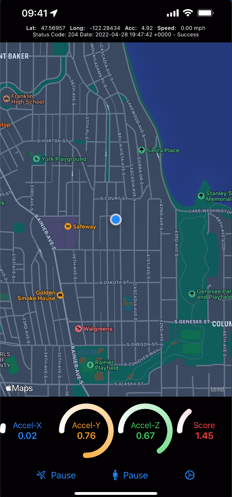
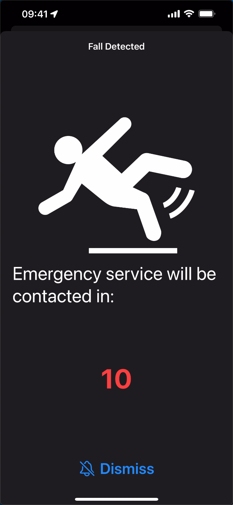
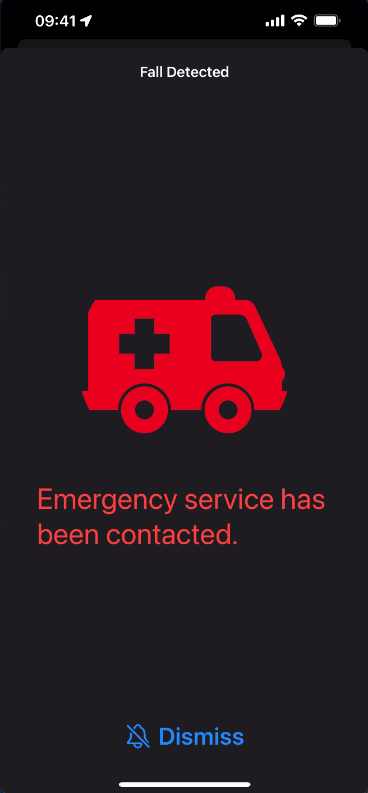
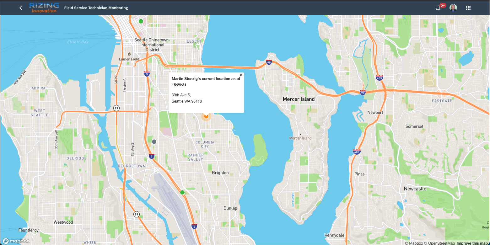
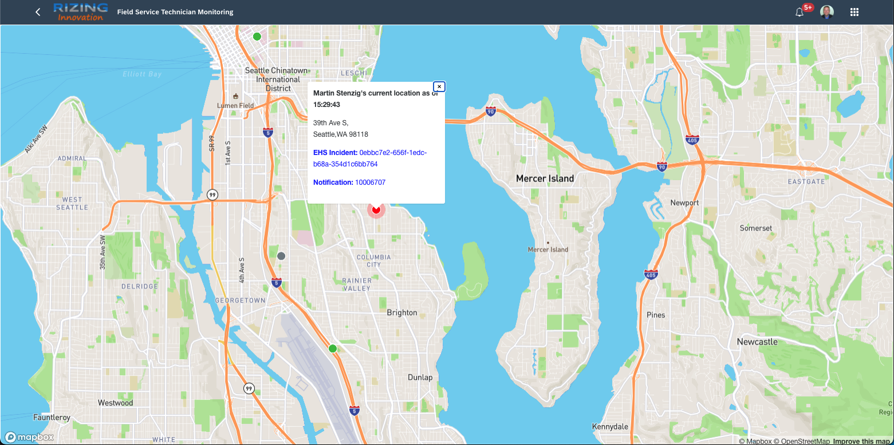
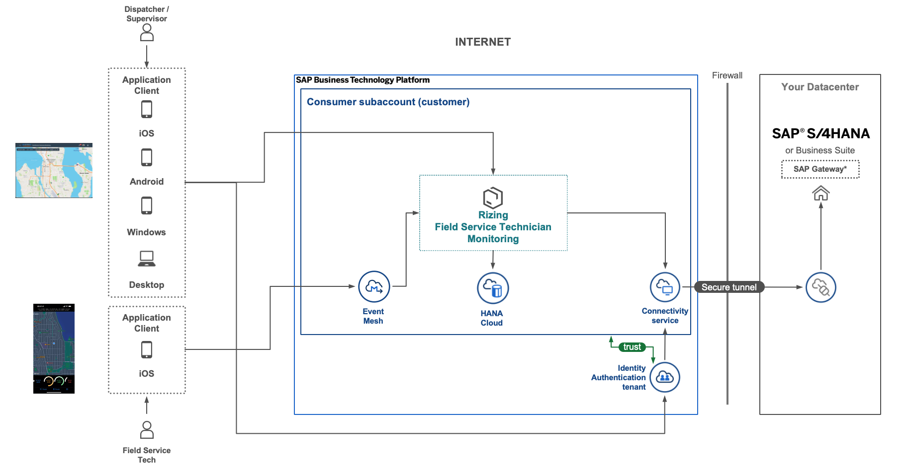
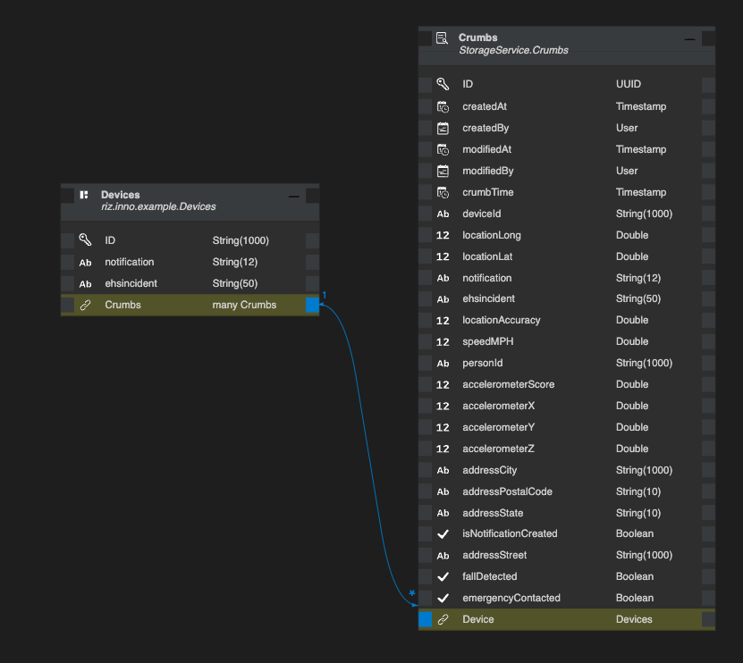

# Field Service Demo 2022
This repo showcases the use of CAP in the context of Field Service work. As a company, we want to have continous visibility of the location of our Field Service technicians.


This demo takes it a step further and reacts to possible falls. Falls are detected based on accelerometer data from connected IPhones. 

We did a more business centric overview and demo at Sapphire 2022 in Orlando and the slides are available [here](./doc/sapphire_presentation/BTP127_CAPCustomerSuccessStory_Final.pdf). 

## The IPhone App
Each technician has a custom app installed on their IPhone. In normal execution mode it will send the current Geo-Location to the server. At the same time it monitors the accelerometer data and triggers a sepecial message should the value exceed a preset threshold. 

<table width="100%" border="0"><tr>
<td></td>
<td></td>
<td></td>
</table>

## The Dispatcher App
The dispatcher app is a simple web application that allows the dispatcher to view the current location of all our field service technicians. 

Once a fall is detected, the dot starts pusating, is color coded in yellow and a popup with the current location of the technician appears. 

If the technisian does not dismiss the popup in his/her's IPhone App, the status progresses to red and an EHS incident and EAM Notification are created
<table width="100%" border="0"><tr>
<td></td>
<td></td>
</table>

# The Technology
1. At its core is a [SAP Cloud Application Programming Model](https://cap.cloud.sap/docs/) application (most of its functionality is implemented in the [service handler](./srv/handlers/storage.js))  that
    - Receives technician data from an event-mesh instance
    - Stores the data in a HANA Cloud database
    - pushes the data via Web Sockets to all connected clients
    - creates a SAP Incident in a connected S/4 on-premise 2021 instance
2. A custom built IPhone app tracks the movements of the technician and sends bread crumbs to the event-mesh instance. (sources of the IPhone app are not available in this repo)
3. The event-mesh instance receives the bread crumbs under a topic called 'gpslocation'
4. A simple client application visualizes the current locatiton of all our field service technicians on the map and shows an alert once a fall was detected. <br>
The sources for the Dispatcher App can be found [here](./app)

## Solution Architecture


## Data Model
The data model is simple and aligns with the IoT informationation we receive from the IPhone App.




# ReCAP 2022 Presentation/Lessons Learned
- Demo & Business Overview based on README.md
- Download environment cf extension
- Web Sockets
    - Easy to implement on client and server and good value
    - Implementation in server.js and storage.js handler
- Messaging
    - AMQP vs. WebHooks (especially around local testing)
        - See scripts show_cap_processes.sh / kill_cap_processes.sh
- Geospatial DataTypes
    - No testing unless HANA as DB


# Testing
## To run the application locally
1. Generate a default-env.json in the root of the project
    - The easiest way is to use the cloud foundry [CLI extension](https://github.com/saphanaacademy/DefaultEnv) provided by the SAP HANA Accademy. It allows for a command of 'cf de [service name]'

## To use the .http files 
...you must
1. Install the VS Code REST Client https://marketplace.visualstudio.com/items?itemName=humao.rest-client
2. Create a file with name '.env' in the root of this project. That file should contain the following lines (please makes sure to provide the values relevant to your environment):
```.env
 S4_URL=<https://yours4system>
 S4_BASIC_USERNAME=<yours4username>
 S4_PASSWORD=<yours4password>
```


